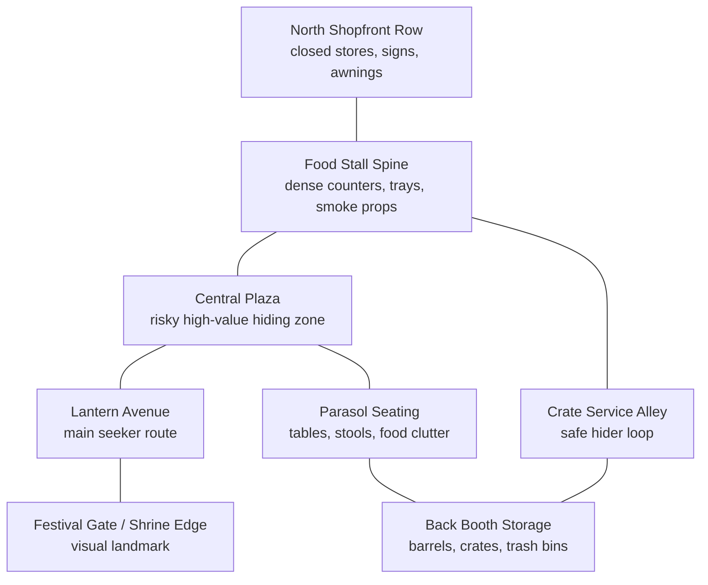
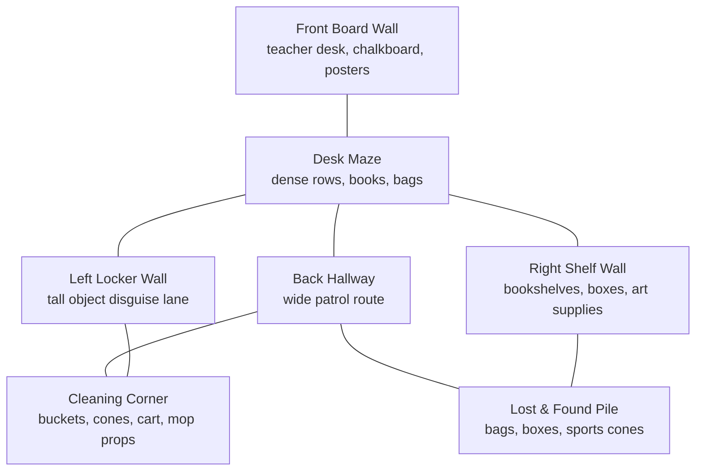
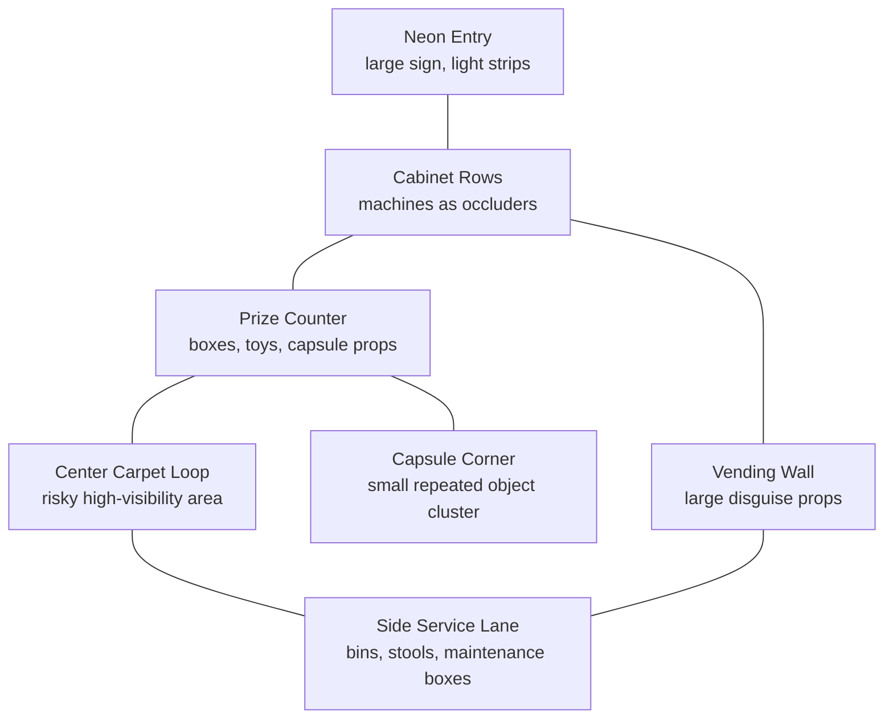

# Scene Design Plan

This plan is for the next visual pass before importing more assets. The goal is to stop treating each arena as a flat playground with scattered props, and instead design each scene around readable hiding zones, believable object clusters, and richer GLB sources.

## Asset Source Strategy

### Preferred Sources

Use these first because they are GLB-friendly and have permissive licensing.

| Source | License | Best Use | Notes |
| --- | --- | --- | --- |
| Kenney | CC0 | Baseline low-poly props, food, streets, buildings | Already used. Keep as fallback/background kit. |
| Quaternius | CC0 | Larger themed packs, fantasy/city/street props, environment dressing | Good for replacing simple procedural scenery with complete low-poly kits. |
| Poly Pizza | Mostly CC0, verify per asset | Individual hero props, school/desk/food/household items | Good for distinctive objects, but every asset license must be checked before import. |
| Eclair Assets | Lists CC0 GLB packs | Mini-market, food, everyday desk props | Good for quick GLB scene dressing; verify source/license per pack. |
| Numinia / Open Source 3D Assets | Mostly CC0 GLB collections | Curated props and structures | Useful discovery layer for CC0 GLB assets. |
| BlendAtlas | CC0 | Household / architecture props | Good for furniture-like set dressing. |
| Artaley3D | CC0 | Higher-quality scanned/made objects | Style may be more realistic than current low-poly art, so use selectively. |

### Use Carefully

| Source | Risk | Rule |
| --- | --- | --- |
| Sketchfab | Mixed licenses: CC0, CC-BY, CC-NC, custom | Only use CC0 or explicitly approved CC-BY with an attribution file and in-game/about attribution. Never use NC. |
| Itch packs from unknown authors | Licenses vary | Only use if the page clearly says CC0 or allows commercial use without attribution. |
| Aggregators | Metadata may be stale | Use them for discovery, then verify license at the original asset page. |

## Current Visual Problem

- Festival has more food assets now, but the world still lacks compositional intent.
- School has density, but the prop groups need more purpose: lockers, bags, papers, shelves, cleaning area, teacher desk, and classroom lanes should read as zones.
- Arcade has stronger identity, but needs richer cabinets, prize counters, capsule machines, signs, and light pools.
- The player should immediately understand where good hiding choices exist.

## Design Rules

- Every arena needs 4-6 named zones.
- Every zone needs a prop family: repeated real objects plus a few objects that hiders can mimic.
- Hiding props must appear in plausible clusters, not isolated in open space.
- Each arena should have a main route, side loops, and at least two risky central hide zones.
- Use asset kits to create silhouettes first, then tune lighting/materials.
- Import GLBs into `public/assets/third-party/<source>/<pack>/`.
- Track all imported sources in `ASSET_CREDITS.md`.

## Festival Town Layout

Theme: night market / festival food street.

Target mood: warm, busy, readable, playful.

Primary asset needs:
- Food stalls with signs and awnings.
- Food display props: bowls, skewers, trays, cups, cartons, fruit, packaged snacks.
- Street dressing: lantern poles, banners, parasols, crates, barrels, trash bins, small stools.
- Backdrop: shopfronts, shrine gate or festival entrance, paper lantern strings.

### Festival Zone Plan

| Zone | Function | Prop Families |
| --- | --- | --- |
| Food Stall Spine | Main visual identity and prop-hunt core | Food trays, cartons, cups, bowls, signs, counters |
| Central Plaza | Risky area with many repeated objects | Lanterns, stools, parasols, baskets |
| Crate Service Alley | Safer loop with occlusion | Crates, barrels, trash bins, supply boxes |
| Parasol Seating | Mid-risk hiding zone | Tables, stools, cups, trays, umbrellas |
| Shopfront Row | Backdrop and boundary | Awnings, signs, vending/booth fronts |
| Festival Gate | Landmark and orientation | Gate, lanterns, banners |

### Festival Import Candidates

- Eclair Mini Market GLB Pack: market shelving/counters/signage if license verifies CC0.
- Quaternius city/street props: bins, benches, stalls, signs.
- Poly Pizza CC0 individual food/sign props where distinctive.
- Keep Kenney Food Kit for broad food variety.

## School After Hours Layout

Theme: empty school after hours, classroom plus hallway.

Target mood: readable, quiet, cluttered enough for deception.

Primary asset needs:
- More realistic classroom furniture GLBs: desks, chairs, lockers, shelves, teacher desk.
- Small clutter: books, notebooks, bags, pencil cups, paper stacks, cleaning buckets.
- Wall props: posters, notice boards, clocks, classroom labels.
- Hallway dressing: lockers, cones, cleaning cart, lost-and-found boxes.

### School Zone Plan

| Zone | Function | Prop Families |
| --- | --- | --- |
| Desk Maze | Core hiding field | Desks, chairs, books, bags, paper stacks |
| Locker Wall | Tall prop disguise and line-of-sight breaks | Lockers, bags, signs |
| Shelf Wall | Dense object clusters | Bookshelves, boxes, classroom supplies |
| Front Board | Landmark and seeker orientation | Board, posters, teacher desk |
| Cleaning Corner | Distinct prop family for disguise | Bucket, cone, mop, cart |
| Back Hallway | Patrol loop | Cones, benches, lost-and-found boxes |

### School Import Candidates

- Poly Pizza CC0: desks, chairs, books, bags, shelves, clocks if available.
- BlendAtlas CC0 household/architecture props for shelves, tables, household clutter.
- Sketchfab only if CC0 or explicit approved CC-BY: classroom asset packs.
- Eclair Everyday Home & Desk Props GLB Pack if license verifies CC0.

## Arcade Mall Layout

Theme: neon arcade corridor / prize mall.

Target mood: flashy, readable, high contrast.

Primary asset needs:
- Arcade cabinets, prize machines, capsule machines, vending machines.
- Prize clutter: plush-like shapes, boxes, balls, signs, tokens.
- Neon signs and light strips.
- Seating and trash bins.

### Arcade Zone Plan

| Zone | Function | Prop Families |
| --- | --- | --- |
| Cabinet Rows | Strong visual identity and occlusion | Cabinets, stools, screens |
| Prize Counter | Dense small prop area | Boxes, toys, capsules, signs |
| Vending Wall | Large suspicious props | Vending machines, standees, bins |
| Capsule Corner | Small repeated props | Capsule machines, balls, prize boxes |
| Center Carpet Loop | Risky route | Neon floor, stools, standees |
| Service Lane | Safer flank | Maintenance boxes, trash bins, cones |

### Arcade Import Candidates

- Quaternius props or sci-fi/city kits for machines/signage-like shapes.
- Poly Pizza CC0 for vending machines, arcade cabinets, stools, trash bins.
- Eclair Mini Market GLB Pack for retail shelving and signage.
- Kenney remains backup for road lights/signs and simple low-poly props.

## Implementation Plan

1. Build an asset manifest:
   - `src/assets/assetManifest.js`
   - Fields: `id`, `source`, `license`, `url`, `localPath`, `themeTags`, `scale`, `category`.
2. Add a source folder structure:
   - `public/assets/third-party/quaternius/...`
   - `public/assets/third-party/poly-pizza/...`
   - `public/assets/third-party/eclair/...`
3. Import one richer pack per arena first:
   - Festival: market/shop pack.
   - School: desk/classroom/office prop pack.
   - Arcade: retail/arcade/neon-compatible prop pack.
4. Replace procedural placeholder families with GLB families:
   - `createFoodStand()`
   - `createDeskSet()`
   - `createArcadeCabinet()`
5. Convert prop placement into zone data:
   - `arena.zones[]`
   - `arena.propClusters[]`
   - `arena.spawnRules[]`
6. Add a debug top-down layout mode later:
   - Toggle to inspect zones, seeker routes, hiding density, and prop families.

## Acceptance Bar For Next Visual Pass

- Festival should read as a market street even with UI hidden.
- School should read as a classroom/hallway, not a generic warehouse.
- Arcade should read as an arcade mall, not a dark room with boxes.
- Each screenshot should show at least 3 obvious themed zones.
- Every hider prop option should appear repeatedly in the environment as real objects.
- No colored primitive should be used as a final visible food/item prop unless it is intentionally stylized and designed.

## Sources Reviewed

- Kenney Food Kit: https://kenney.nl/assets/food-kit
- Quaternius: https://quaternius.com/
- Quaternius licensing reference: https://gamefromscratch.com/quaternius-free-3d-assets/
- Eclair Assets: https://eclair-assets.itch.io/
- Eclair Mini Market GLB Pack: https://eclair-assets.itch.io/mini-market-glb-pack-20-free-cc0-3d-models
- Eclair Everyday Home & Desk Props GLB Pack: https://eclair-assets.itch.io/everyday-home-desk-props-glb-pack-30-free-cc0-3d-models
- Numinia / Open Source 3D Assets: https://www.numinia.store/
- BlendAtlas Architecture Assets: https://blendatlas.com/products/architecture-assets-cc0-now
- Artaley3D: https://artaley3d.com/
- Poly Pizza: https://poly.pizza/
